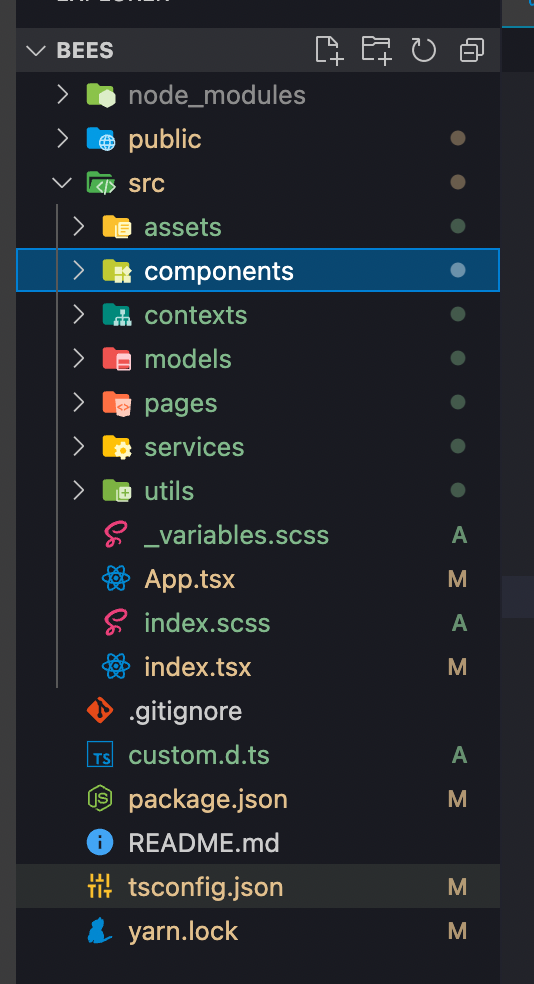

# Teste Bees

Projeto utilizando ReactJS, Axios, SASS.

Tempo gasto: 2h 15.

## Estrutura de pastas

## Notas
"src/pages/Breweries" => Eu poderia fazer diferente também, inferindo o tipo na hora da chamada, exemplo: `axios<Brewery[]>`. Para isso eu precisaria mudar a implementação do Http.ts.

"src/pages/Breweries" => Eu também poderia ter usado o useReducer, dei uma olhada inclusive, porém, para o teste, me senti mais confortável utilizando o que já estou acostumado a usar.